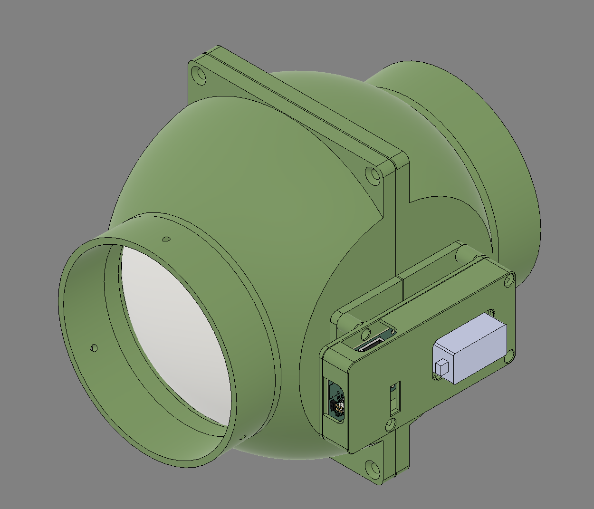
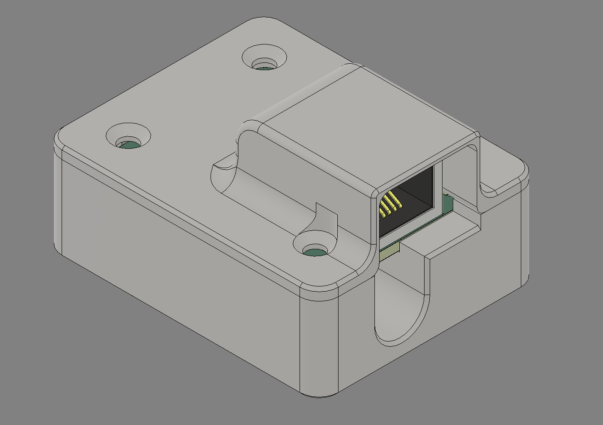

- [Electronics](#electronics)
  - [Brain board](#brain-board)
  - [Sensor Board](#sensor-board)
  - [Hardware](#hardware)
  - [Power](#power)
  - [Alternative power wiring](#alternative-power-wiring)
  - [ESP32 SuperMini Variants](#esp32-supermini-variants)
- [Blast Gate](#blast-gate)
  - [Gate](#gate)
  - [Sensor Box](#sensor-box)

Open-source automated blast gate system and tool detection system.

## Implementation
Currently, this is implemented using ESPHome with dependencies on Home Assistant to handle the syncing between gates.

Eventually, the goal is to have two versions - one with ESPHome, one standalone using something like ESP32-IDF/ESP-Now for communication between gates.
ESPHome's advantage is any buttons/remotes (Zigbee, ZWave, Matter, Wifi) connected to Home Assistant can be used to trigger each gate, as well as rapid development and deployment.

# Electronics
## Brain board 
[Schematic](pcb/HonkLockBrainboard.pdf)
| Item                                                                | Quantity | Note                                                                                                                                                                                                                                                                                                                                                                                                                                                             |
| ------------------------------------------------------------------- | -------- | ---------------------------------------------------------------------------------------------------------------------------------------------------------------------------------------------------------------------------------------------------------------------------------------------------------------------------------------------------------------------------------------------------------------------------------------------------------------- |
| [ESP32 S3 SuperMini](https://s.click.aliexpress.com/e/_c3BMFE2p)    | 1        | (Just about) Any ESP32 is going to work. The supermini's are just adorably tiny, inexpensive, and relatively easy to come across from a range of vendors.   The Supermini range also has an onboard WS2812 LED (GPIO48), meaning gate status can be indicated (red = closed, green = open) with the included LED.  **Other supermini variants <ins>except H2 (no wifi)</ins> _should_ work just fine, you will just need to adjust the code slightly.** |
| [0.1uF ceramic cap](https://www.lcsc.com/product-detail/C1711.html) | 2        | 0805/2012 package                                                                                                                                                                                                                                                                                                                                                                                                                                                |
| [1uF ceramic cap](https://www.lcsc.com/product-detail/C28323.html)  | 1        | 0805/2012 package                                                                                                                                                                                                                                                                                                                                                                                                                                                |
| [10k resistor](https://www.lcsc.com/product-detail/C17414.html)     | 2        | 0805/2012 package                                                                                                                                                                                                                                                                                                                                                                                                                                                |
| [33k resistor](https://www.lcsc.com/product-detail/C17633.html)     | 2        | 0805/2012 package                                                                                                                                                                                                                                                                                                                                                                                                                                                |
| [P82B715 (SOIC)](https://www.lcsc.com/product-detail/C2649394.html) | 1        | I2C Extender                                                                                                                                                                                                                                                                                                                                                                                                                                                     |
| [USB jack](https://www.lcsc.com/product-detail/C2765186.html)       | 1        | Ignore if not using USB for power                                                                                                                                                                                                                                                                                                                                                                                                                                |
| [5.1k resistor](https://www.lcsc.com/product-detail/C27834.html)    | 2        | Ignore if not using USB for power, 0805 size                                                                                                                                                                                                                                                                                                                                                                                                                     |
| [RJ-45 jack](https://www.lcsc.com/product-detail/C7501824.html)     | 1        |                                                                                                                                                                                                                                                                                                                                                                                                                                                                  |
| [3 pin JST XH](https://www.lcsc.com/product-detail/C157928.html)    | 1        | S3B-XH-A-LF                                                                                                                                                                                                                                                                                                                                                                                                                                                      |

## Sensor Board
[Schematic](pcb/HonkLockSensorBoard.pdf)
| Item                                                                | Quantity | Note                                   |
| ------------------------------------------------------------------- | -------- | -------------------------------------- |
| [MLX90393](https://www.lcsc.com/product-detail/C2649492.html)       | 1        | magnetometer for detecting tool on/off |
| [0.1uF ceramic cap](https://www.lcsc.com/product-detail/C1711.html) | 3        | 0805/2012 package                      |
| [1uF ceramic cap](https://www.lcsc.com/product-detail/C28323.html)  | 1        | 0805/2012 package                      |
| [10k resistor](https://www.lcsc.com/product-detail/C17414.html)     | 2        | 0805/2012 package                      |
| [33k resistor](https://www.lcsc.com/product-detail/C17633.html)     | 2        | 0805/2012 package                      |
| [P82B715 (SOIC)](https://www.lcsc.com/product-detail/C2649394.html) | 1        | I2C Extender                           |
| [RJ-45 jack](https://www.lcsc.com/product-detail/C7501824.html)     | 1        |                                        |

##  Hardware
| Item                                    | Quantity | Note                                              |
| --------------------------------------- | -------- | ------------------------------------------------- |
| 'Standard Servo'                        | 1        | I've used a MG996 clone                           |
| M2.5 heatset inserts, standoffs, screws |          | Design not 100% finalised                         |
| M4 and M5 Hardware                      |          | Design not 100% finalised                         |
| Ethernet cable                          |          | For connecting the brainboard to the sensor board |

## Power
HonkLock is powered by any 5v1a USB brick - A or C.

## Alternative power wiring
If you'd rather have centralised power that runs out to each gate, you'll need to [calculate the wire required](https://www.omnicalculator.com/physics/wire-size).

## ESP32 SuperMini Variants  
There are a range of ESP32 "Supermini dev boards", most of which have identical pinouts, but not all are suitable.

| Variant | Suitable | Note                                                                                                                            |
| ------- | -------- | ------------------------------------------------------------------------------------------------------------------------------- |
| S3      | ✅        | Dual core Xtensa CPU, previous top of the line chip. Total overkill for this application, but so common that it isn't expensive |
| C3      | ✅        | A lower power/slower alternative to the S3 using a RISC-V singlecore CPU and has 2.4ghz wifi                                    |
| C3 Plus | ✅        | Seems to be a C3 with external antenna option                                                                                   |
| C6      | ✅        | Single core RISC-V chip, with Wifi 6 (2.4ghz) and thread/zigbee/matter support                                                  |
| H2      | ❌        | ESP32-H2 does not have Wifi at all, it has Bluetooth 5LE and thread/zigbee. Currently Wifi is a HonkLock requirement            |

# Blast Gate
## Gate

The current design is for *my* system, and thus is for 5" ducting. Fusion360 file provided for modification, eventually will model for different sizes.

* Blastgate: [Fusion360](CAD/BlastGate.f3z), [STEP](CAD/BlastGate.step), 3MF.
* Print in PETG, available on Makerworld with slicing settings built in.

## Sensor Box

* Sensor Box: [Fusion360](CAD/SensorBox.f3z), [STEP](CAD/SensorBox.step.step), 3MF.
* Print in PETG, available on Makerworld with slicing settings built in.
* Requires 4x M2.5 heatset inserts and M2.5 x 8mm screws
